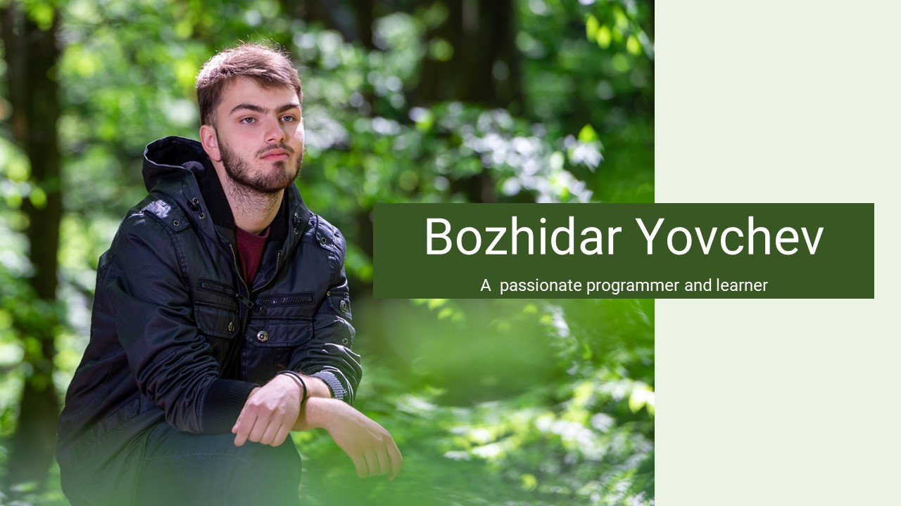

# Hi, welcome to my GitHub! 

My name is Bozhidar and I am am an enthusiastic programmer with
extensive experience in a variety of programming languages like C#, 
C++, and Python. My passion lies in exploring the exciting world of AI,
and I aim to specialize in machine learning and AI technologies in the future.

I am also a bibliophile who loves to read literature on science, astronomy, psychology, 
and technology in order to increase my knowledge and widen my perspective. Video gaming,
walking in the woods, and traveling are my other interests during free times. Always, 
it would be curiosity-gripping motives to know more about recent developments in AI 
technologies and apply them to real-world problems.

I look forward to reaching out to other developers
and contributing to some exciting projects in the AI space!

 

## 👨‍💻 About me
*  I'm from Bulgaria
* 🖥️ Learning programming
*   My most used language is C#
* 📚 Love learning new stuff and teaching others

 

## 🛠️Tech Stack
- 👩‍💻 Programming Languages:

    &nbsp;
    &nbsp;
    &nbsp;
 
 - 📊 Databases:
    
    &nbsp;

 

---
 

  <i>Let's connect! Find me on...</i>
   

<a href="https://www.linkedin.com/in/bozhidar-yovchev/">
  <code></code>
</a>
<a href="mailto:bozhidar601@gmail.com">
<code></code>
</a>

  

